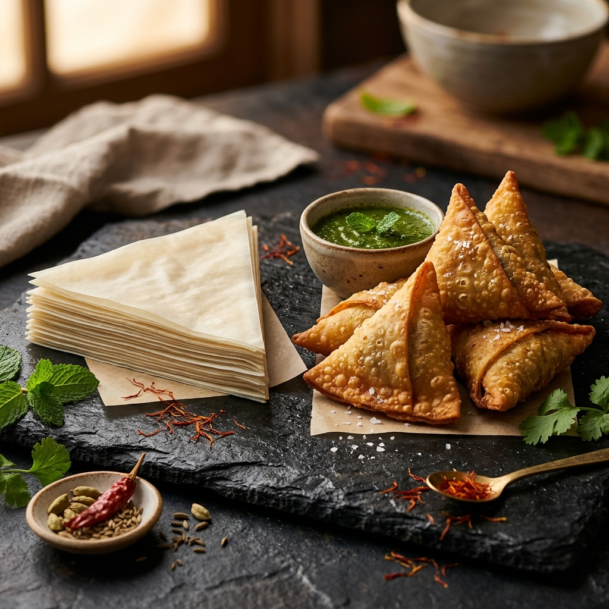

# 🥟 SamosaSheet — Fresh Samosa Sheets & Patti Website

A modern, high-performance, feature-complete web application built for **SamosaSheet** (Karpagam Foods, Chennai). Designed from the ground up using **pure HTML5, Vanilla CSS3, and Vanilla JavaScript** without any external CSS frameworks like Tailwind or Bootstrap.



---

## 🌟 Key Features & Highlights

### 🎨 Dual Theme System (Light & Dark)
- **Default Light Theme (*Warm Gourmet Saffron & Mint*)**: Features a warm ivory cream background (`#fdfbf7`), crisp white glassmorphic card surfaces, deep charcoal headings (`#0f172a`), and rich saffron gold accents.
- **Dark Theme (*Royal Obsidian & Saffron Gold*)**: Features a midnight obsidian background (`#0b0f17`), dark slate cards, and glowing golden highlights.
- **Interactive Theme Switcher**: Sun/Moon toggle button located in both the header bar and mobile drawer with `localStorage` memory to save user preference.

### 🧭 Compact Dropdown Navigation
- Space occupancy reduced by **over 50%** by grouping 9 individual links into structured dropdown menus:
  - **`Products & Tools ▾`**: Sheet Sizes (5", 7", 8"), Pack Calculator, Recipe Inspirations.
  - **`Guide & Info ▾`**: Step-by-Step Folding Guide, About Karpagam Foods, FAQs.
  - **Top Level Links**: `Home`, `Bulk Orders`, `Contact`.

### 📲 Quick WhatsApp Order Modal
- Interactive modal triggered from any product card or CTA button.
- Select sheet size (Small 5×5", Medium 7×7", Large 8×8"), adjust pack quantities with `+` / `-` steppers, enter delivery address, and generate a formatted WhatsApp message sent directly to **+91 90953 33944**.

### 🧮 Smart Sheet Pack Quantity Calculator
- Computes how many 100-sheet packs you need based on:
  - Estimated number of guests / servings.
  - Consumption rate (1 to 4 samosas per person).
  - Selected sheet dimensions.
- Calculates recommended flour-water sealing paste quantities.

### 📜 Step-by-Step Folding & Cooking Guide
- 6-step visual guide detailing:
  1. Thawing frozen sheets.
  2. Preparing cool fillings.
  3. Cone folding.
  4. Filling techniques.
  5. Flour-paste sealing.
  6. Deep-frying or air-frying instructions.

### 👨‍🍳 Recipe & Filling Inspirations
- Interactive tabbed switcher for 4 popular fillings:
  - **Classic Spiced Potato & Peas** (Aloo Samosa)
  - **Paneer Tikka & Capsicum**
  - **Hyderabadi Spiced Chicken Keema**
  - **Sweet Corn & Melted Cheese**

### 🏬 Wholesale B2B Supply Form
- Dedicated B2B enquiry section for commercial clients (Restaurants, Hotels, Caterers, Tea Shops, Bakeries, Supermarkets).
- Generates instant bulk price quote requests on WhatsApp.

### ❓ FAQ Accordion
- Accessible expandable accordion addressing cold storage (2°C - 5°C), long-term freezing (-18°C), air-frying guidelines, and regional shipping across South India.

### 🎨 Custom Side Scrollbar
- Styled Webkit & Firefox side scrollbars with a Saffron Gold to Terracotta gradient thumb and glowing hover effects matching the active theme.

---

## 📂 Project Directory Structure

```
Samosa/
├── index.html            # Main single-page web application & markup
├── css/
│   └── style.css         # Complete CSS design system, dual theme tokens & layouts
├── js/
│   └── app.js            # Vanilla JS engine (dropdowns, theme toggle, modals, calculator)
├── assets/
│   └── images/           # High-resolution food photography assets
│       ├── hero.png
│       ├── small-sheet.png
│       └── medium-sheet.png
└── README.md             # Project documentation & guide
```

---

## 🛠️ Technology Stack

| Technology | Purpose |
| :--- | :--- |
| **HTML5** | Semantic layout structure, ARIA accessibility, JSON-LD structured data, SEO meta tags |
| **Vanilla CSS3** | Dual theme CSS tokens (`:root`, `[data-theme="light"]`, `[data-theme="dark"]`), glassmorphism, responsive flex/grid |
| **Vanilla JavaScript** | DOM interaction, dropdown controller, theme persistence, WhatsApp message generator, calculator logic |

---

## 🚀 Getting Started

### Local Viewing
1. Clone or download this repository:
   ```bash
   git clone https://github.com/jayanthansenthilkumar/Samosa.git
   ```
2. Open `index.html` directly in any web browser.

### Running a Local Server
Run Python's built-in HTTP server:
```bash
python -m http.server 8080
```
Open `http://localhost:8080/` in your browser.

---

## 📞 Company Contact Details

**Karpagam Foods (SamosaSheet)**  
📍 **Address:** No. 88, 7th Street, Azhagammal Nagar, Nerkundram, Chennai – 600107, Tamil Nadu, India  
📞 **Phone / WhatsApp:** [+91 90953 33944](tel:+919095333944)  
✉️ **Email:** [orders@samosasheet.com](mailto:orders@samosasheet.com)  
🌐 **Website:** [samosasheet.com](https://samosasheet.com/)

---

## 🛠️ Developer Branding

**AustralAI** — Powered by [Aventrea.me](https://aventrea.me)  
*Created with ❤️ for Karpagam Foods using pure HTML, CSS, and Vanilla JavaScript.*
